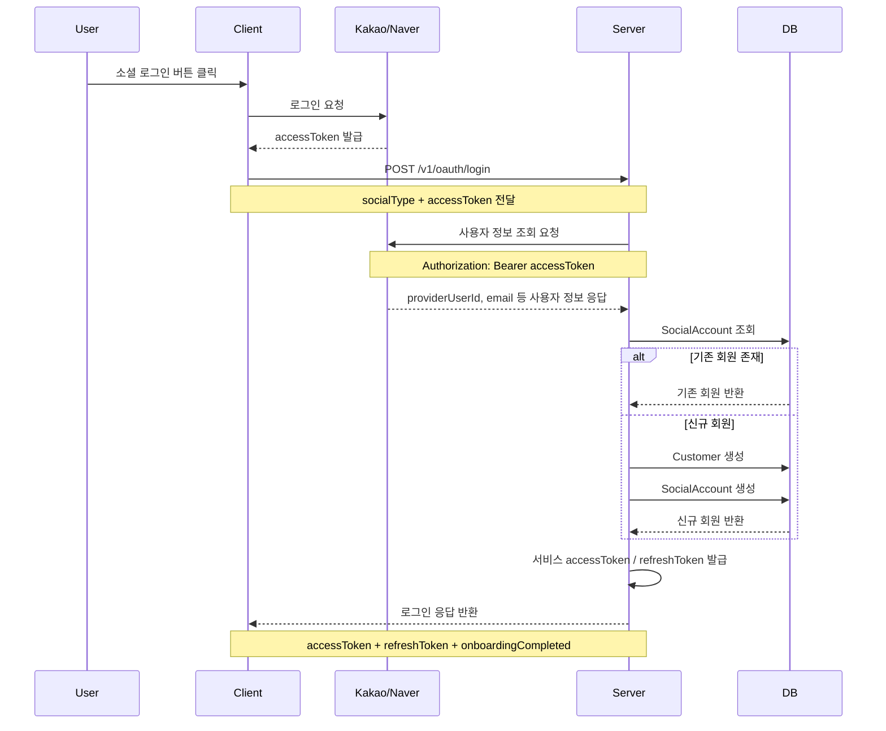
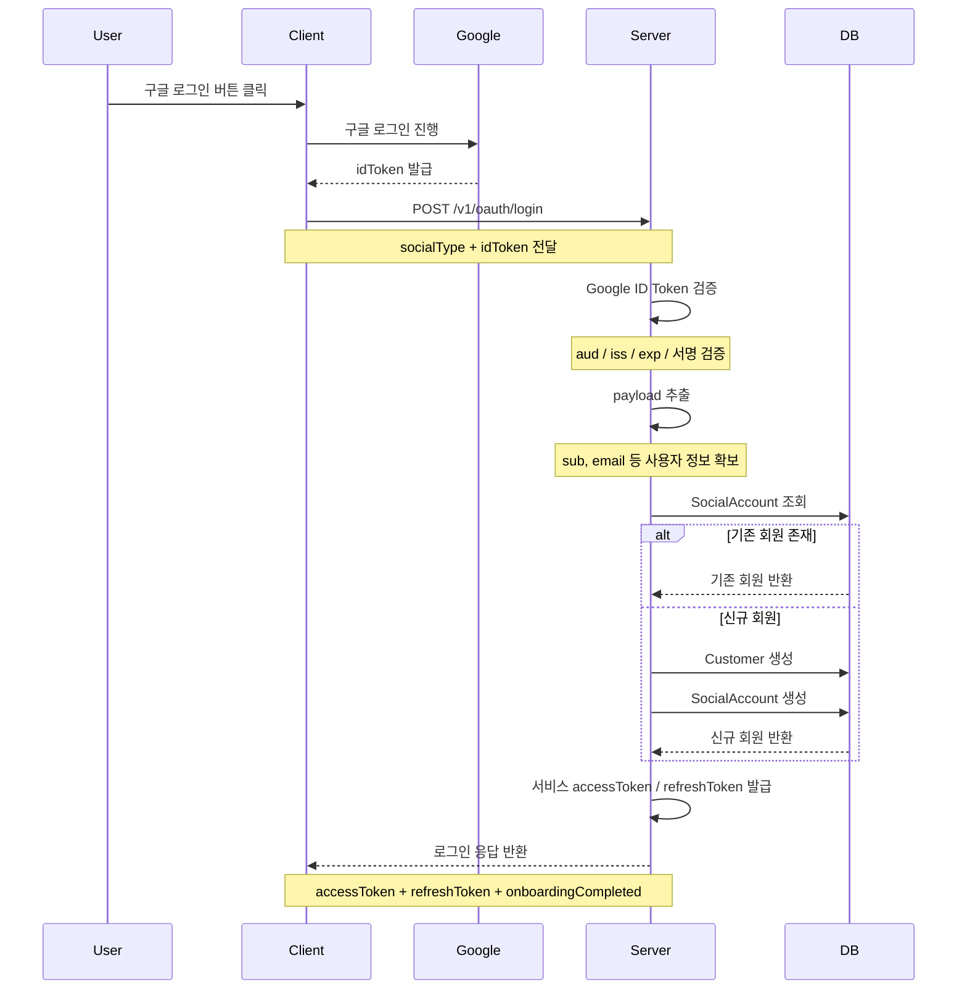

# 💠 Beans Pirates

**The Essence of Kinetic Intelligence**

우리는 복잡한 데이터 망을 조율하여 신체 움직임의 본질적인 진실을 찾아내는 고성능 기술 스택을 구축합니다.  

SAiM: B2C 형태의 AI 피트니스 코칭 시스템

SAiM Manager: 피트니스 조직의 CRM Tool

---

### 🚀 Core Focus
* **Kinetic Analysis:** 실시간 신경망 분석을 통한 정밀한 피트니스 가이드 및 데이터 기반 케어 솔루션 연구.
* **High-Performance Backend:** 대규모 데이터 처리를 위한 견고하고 확장 가능한 시스템 설계.
* **System Orchestration:** 복잡한 서비스 메시를 완벽하게 제어하는 프레임워크 및 인프라 최적화.

---

### 🌐 Contact & Collaboration

우리는 기술적 한계를 돌파하고, 기술로 미래를 구현합니다.

* **Website:** [beans-pirates.co.kr](https://beans-pirates.co.kr)
* **Location:** Korea, South

---
*Beans Pirates - Exploring the boundaries of movement and technology.*
